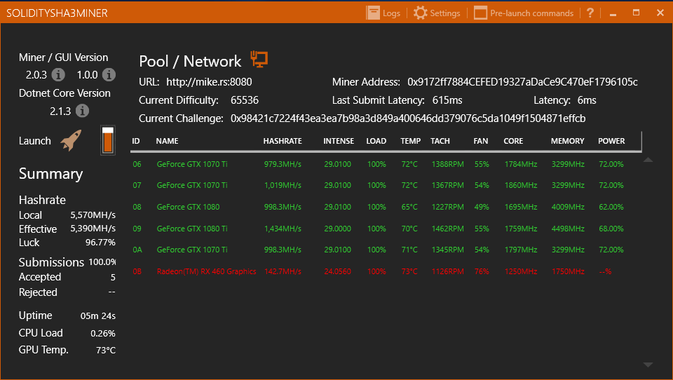
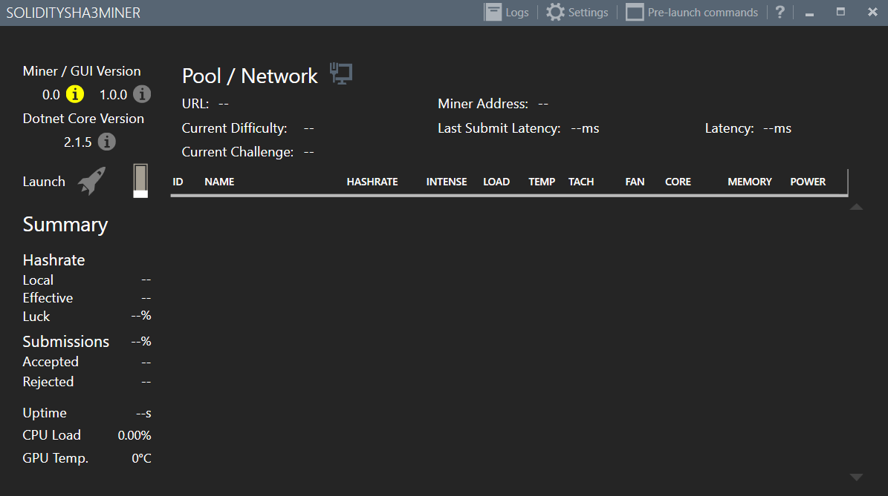
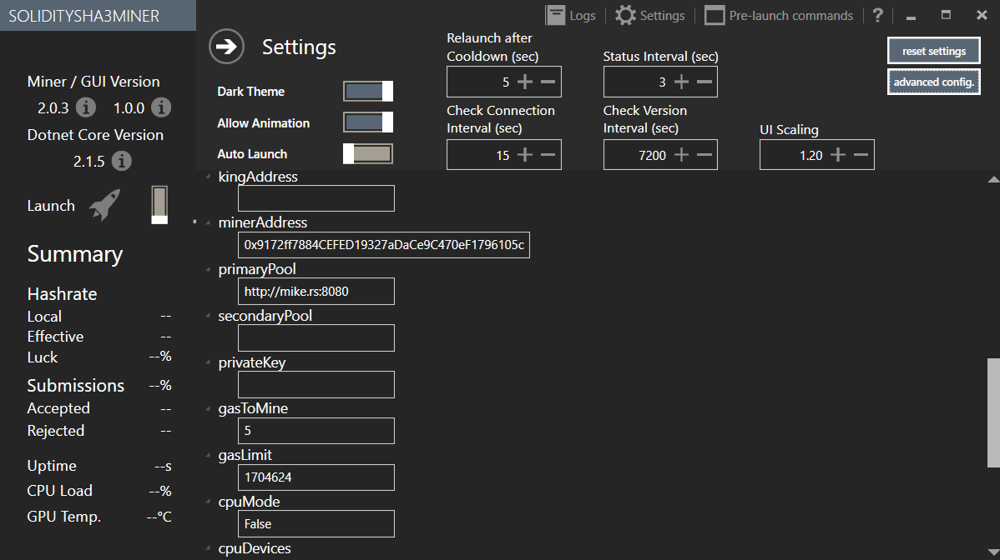

# SoliditySHA3MinerUI
GUI wrapper and updater for [SoliditySHA3Miner](https://github.com/lwYeo/SoliditySHA3Miner). SoliditySHA3MinerUI is licensed under the [MIT license](LICENSE).

Built for Windows 10 x64 with C#.NET Framework 4.6.2 

### Releases can be found [here](https://github.com/lwYeo/SoliditySHA3MinerUI/releases).
If you are looking for a console Windows/Linux version, refer to this link [https://github.com/lwYeo/SoliditySHA3Miner/releases]

## Quick Start guide (for mining 0xbitcoin)

1) Click on the yellow "i" icon on the top left to download and install the latest miner.

2) If the "i" icon below "Dotnet Core Version" is red, click on it to download Dotnet core runtime installer, install it and relaunch the application.

3) Go to Settings (one of the top buttons), a sub-menu will appear.

4) Update your mining ETH address of your choice (CasSe sensitive).

5) Update the pool URL of your choice (or you can leave as default).

6) Click on the back icon (the right-arrow on the top left), a dialog will prompt you to save. Click OK to save.

7) Click on the launch toggle switch next to the rocket icon on the left to start mining!

(*) To populate GPU list in settings, you will need to start mining at least once. Restart mining to take effect.

### Note for solo miners
You will/may need update the following fields as well:
 - web3api
 - contractAddress
 - abiFile
 - overrideMaxTarget
 - privateKey
 - gasToMine
 - gasLimit
 
